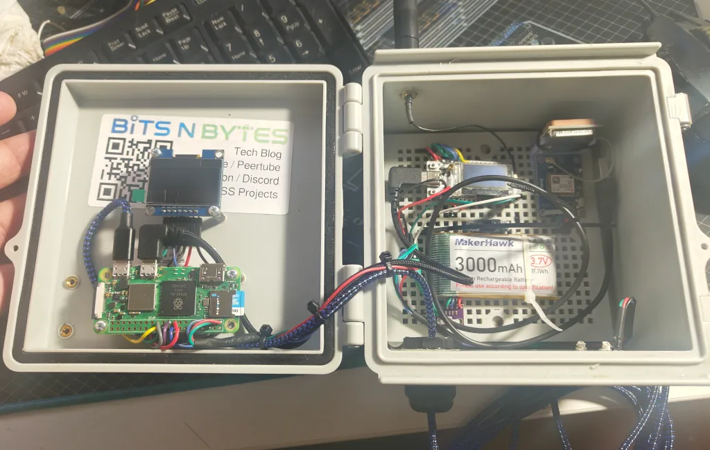
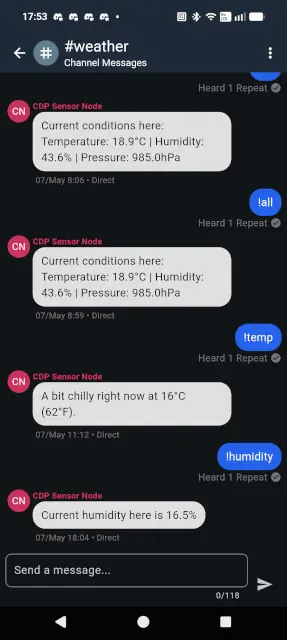

# Raspberry PI Mesh Weather Sensor

Integrates with MeshCore and Home Assistant for logging local weather data
and providing basic chat support on the Mesh network.

Designed to run on a Raspberry Pi, but should be compatible with any Linux-based device.

The host device will listen on a "#weather" channel and respond with the current weather data.
Direct messages over the mesh are supported too.


## Expected Hardware

* Raspberry Pi (Zero W or better)
* BME280 Temperature/Humidity/Pressure Sensor
* MeshCore-compatible USB companion device
* Microcenter 1.3" OLED Display (345785)

Refer to our [build guide](https://bitsnbytes.dev/posts/2026-05/pi-mesh-weather-sensor.html)
for details on assembling the hardware for this project and wiring schematics.




## Installation

```bash
git clone git@github.com:BitsNBytes25/Raspberry-Pi-Mesh-Weather.git
cd Raspberry-Pi-Mesh-Weather

# Copy .env.example to .env and edit as needed
cp .env.example .env
vim .env

# Run the install script
chmod +x install.sh
./install.sh
```

## Supported Commands (Weather channel)

* !temperature - Get the current temperature
* !humidity - Get the current humidity
* !pressure - Get the current pressure
* !all - Get temp, humidity, and pressure
* !forecast - Get the 1-day forecast
* !alerts - Get any current weather alerts




## Supported Commands (direct message)

* help - Get a list of supported commands
* temperature - Get the current temperature
* humidity - Get the current humidity
* pressure - Get the current pressure
* ping - Ping the device
* uptime - Get the uptime of the device
* cpu - Get the CPU usage of the device
* wake - Wake the device display for 2 minutes
* forecast - Get the 1-day forecast
* alerts - Get any current weather alerts
* 🔒 reboot - Reboot the device
* 🔒 net - Get the current network status

(🔒 denotes commands which require authorization)


## Example Responses

- 🥶 FREEZING! It's 0°C (32°F) - Just stay home and get some hot chocolate!
- 🧊 It's currently 8°C (46°F) - Stay inside or bundle up!
- ☁️ A bit chilly at 12°C (54°F) and rain may be on the horizon.
- ☀️ Perfectly comfortable at 20°C (68°F).  Go out for a nice walk.
- 🥵 It's a hot and muggy 33°C (91°F) but feels like 35°C (95°F).  Take water & limit activity.
